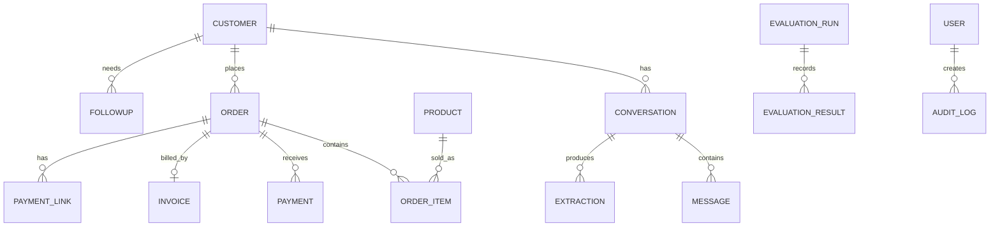

# 🚀 NEXORA AI

### Conversational Business Intelligence • CRM Automation • LLM Evaluation

<p align="center">

  <a href="https://nexora-ai-g4d6.onrender.com/">
    
  </a>

  <a href="https://github.com/bhavyatiwari10/NEXORA-AI">
    
  </a>

</p>

<p align="center">

  
  
  
  
  
  

</p>

<p align="center">

  <b>Transform conversations into structured business intelligence.</b>

</p>

---

# 🌐 Live Application

## 🚀 NEXORA AI — Conversational Intelligence Platform

**Live Dashboard:**  
https://nexora-ai-g4d6.onrender.com/

**GitHub Repository:**  
https://github.com/bhavyatiwari10/NEXORA-AI

**Backend API:**  
https://nexora-ai-backend-cyd6.onrender.com/

**API Documentation:**  
https://nexora-ai-backend-cyd6.onrender.com/docs

> **Demo Mode:** NEXORA uses a deterministic `MockLLM` by default, allowing the complete extraction and analytics workflow to run without an external LLM API key.

---

# 🧠 What is NEXORA AI?

NEXORA AI transforms WhatsApp / Instagram / Telegram-style conversations into structured customer and business data.

It combines an explainable LLM extraction pipeline, CRM automation, order operations, GST invoicing, simulated payments, follow-ups, analytics and a research-grade evaluation module.

> **Academic Framing:**  
> **A Unified User-Centric Evaluation Framework for Large Language Models in Conversational Visual Analytics**

NEXORA is designed as a modern AI SaaS experience rather than a traditional CRUD administration panel.

The platform allows businesses to move from:

```text
Unstructured Customer Conversations
                ↓
        AI Understanding
                ↓
       Structured Business Data
                ↓
          Automated Actions
                ↓
          Business Analytics
```

The dashboard surfaces business signals first and allows users to drill into conversations, customers, orders, finance, follow-ups, analytics and model evaluation.

---

# 🎯 Product Vision

## Chat → Understand → Validate → Act → Measure

NEXORA is built around the idea that businesses already receive valuable information through customer conversations, but much of that information remains unstructured.

Instead of requiring employees to manually convert conversations into CRM records, NEXORA performs the transformation automatically.

```text
💬 Customer Conversation
          ↓
🧠 AI Understanding
          ↓
📋 Structured Business Data
          ↓
✅ Schema Validation
          ↓
👤 CRM / Customer 360
          ↓
🛒 Order Creation
          ↓
🧾 GST Invoice
          ↓
💳 Payment Simulation
          ↓
🔔 Follow-up Automation
          ↓
📊 Business Analytics
          ↓
🧪 LLM Evaluation
```

---

# 🔄 Core Pipeline

```text
Mock / Webhook Chat
       ↓
Message Normalisation
       ↓
LLM Extraction + Explainability
       ↓
Pydantic Schema Validation
       ↓
Entity Resolution
       ↓
CRM / Order Creation
       ↓
GST Invoice + Payment Simulation
       ↓
Follow-up Scheduler
       ↓
Conversational Visual Analytics
       ↓
Evaluation Lab
```

Every stage is designed to be independently testable.

---

# ✨ Feature Map

## 💬 Conversation & Ingestion

- Mock WhatsApp / Instagram / Telegram chat simulator
- TXT/JSON-ready ingestion architecture
- Webhook stubs
- Message normalization
- English, Hindi and Hinglish extraction
- Relative-date interpretation
- Indian currency support
- Typo-tolerant extraction
- Conversation history
- Message-level processing

---

## 🧠 AI / NLP Extraction

- Customer extraction
- Intent extraction
- Product extraction
- Quantity extraction
- Order extraction
- Payment extraction
- Follow-up extraction
- Language detection
- Sentiment classification
- Urgency classification
- Conversation summarization
- Confidence scores
- Source-message evidence
- Explainable extraction results

---

## ✅ Validation & Explainability

- Pydantic schema validation
- JSON validation
- Schema pass checks
- Confidence thresholds
- Source-message evidence
- Validation reports
- Human review queue architecture
- Extraction status tracking

---

## 👤 CRM / Customer 360

- Customer resolution
- Unified customer profiles
- Customer conversation history
- Lead scoring
- Customer segmentation
- Sentiment signals
- Purchase information
- Follow-up history
- AI-enriched customer profiles
- Duplicate-customer strategy
- Customer 360 architecture

---

## 🛒 Order Management

- Product fuzzy matching
- Product catalogue integration
- Order creation
- Quantity handling
- Server-side price calculation
- Order validation
- Duplicate protection
- Order status management

### Order Lifecycle

```text
Draft
  ↓
Confirmed
  ↓
Paid
  ↓
Packed
  ↓
Shipped
  ↓
Delivered
```

Additional states:

```text
Cancelled
Refunded
```

---

## 🧾 GST Invoicing

NEXORA includes GST-aware invoice calculation and PDF generation.

Features:

- Product-based GST rates
- Subtotal calculation
- GST calculation
- Grand total calculation
- Invoice generation
- PDF invoice generation

Workflow:

```text
Product
   ↓
Quantity
   ↓
Subtotal
   ↓
GST Calculation
   ↓
Final Invoice
```

---

## 💳 Payment Simulation

Payment workflows support:

```text
Pending
Success
Failed
Partial
```

The platform includes simulated payment links and payment outcomes for demonstration purposes.

This allows the complete business workflow to be demonstrated without connecting a real payment gateway.

---

## 🔔 Follow-up Automation

NEXORA identifies conversations that require future action.

Examples:

- Delivery follow-up
- Payment reminder
- Customer callback
- Order confirmation
- Lead follow-up

The project includes a scheduler architecture using APScheduler for automated reminder workflows.

---

# 🤖 Ask NEXORA

Ask NEXORA provides a natural-language interface for interacting with business data.

Example questions:

```text
Which customers have pending payments over ₹5,000?

Which products are selling the most?

Which customers need follow-up?

What is the current revenue trend?

Which leads are most likely to convert?
```

Instead of exposing unrestricted SQL execution, NEXORA uses a controlled query-specification approach.

```text
Natural Language Question
          ↓
Query Understanding
          ↓
Whitelisted Query Specification
          ↓
Validated Data Access
          ↓
Business Result
```

This provides a safer architecture for conversational analytics.

---

# 📊 Conversational Visual Analytics

NEXORA extends conversational AI into business analytics.

The system is designed to connect natural-language business questions with structured analytics.

Supported evaluation areas include:

- Query-spec accuracy
- Chart-type correctness
- Insight faithfulness
- Analytical consistency
- Business metric interpretation

---

# 🧪 LLM Evaluation Lab

NEXORA is not only an AI application.

It is also designed as a research-oriented evaluation framework for conversational AI systems.

The evaluation framework considers three major dimensions.

---

## 1. Technical Evaluation

- Field Precision
- Recall
- F1 Score
- Exact Match
- JSON Validity
- Schema Pass Rate
- Hallucination Rate
- Latency
- Token Cost
- Robustness to Typos
- Hinglish Robustness

---

## 2. Visual / Analytical Evaluation

- Chart-Type Correctness
- Query-Spec Accuracy
- Insight Faithfulness
- Analytical Consistency

---

## 3. User-Centric Evaluation

- Task Completion
- Time-to-Task
- Manual Corrections
- Trust
- Clarity
- SUS Usability Score

---

# 🔬 Research Contribution

The academic focus of NEXORA is:

> **A Unified User-Centric Evaluation Framework for Large Language Models in Conversational Visual Analytics**

NEXORA does not evaluate an LLM only on raw extraction accuracy.

Instead, it evaluates the complete user-facing analytical system across:

```text
LLM Output Quality
        +
Analytical Correctness
        +
Visual Understanding
        +
User Trust
        +
Task Completion
        ↓
Unified Evaluation Framework
```

This combines:

```text
Artificial Intelligence
        +
Natural Language Processing
        +
Large Language Models
        +
Conversational Analytics
        +
Visual Analytics
        +
Human-Centered AI
        +
LLM Evaluation
```

---

# 🏗️ System Architecture

```text
                         ┌──────────────────────────┐
                         │   Customer Conversations │
                         │ WhatsApp / IG / Telegram │
                         └────────────┬─────────────┘
                                      │
                                      ▼
                         ┌──────────────────────────┐
                         │ Message Normalization    │
                         └────────────┬─────────────┘
                                      │
                                      ▼
                         ┌──────────────────────────┐
                         │ LLM Extraction Engine    │
                         │ + Explainability         │
                         └────────────┬─────────────┘
                                      │
                                      ▼
                         ┌──────────────────────────┐
                         │ Pydantic Validation       │
                         └────────────┬─────────────┘
                                      │
                                      ▼
                         ┌──────────────────────────┐
                         │ Entity Resolution         │
                         └────────────┬─────────────┘
                                      │
                     ┌────────────────┴────────────────┐
                     │                                 │
                     ▼                                 ▼
            ┌─────────────────┐              ┌─────────────────┐
            │ Customer / CRM  │              │ Order Management│
            │ Customer 360    │              │ Product Matching│
            └────────┬────────┘              └────────┬────────┘
                     │                                 │
                     │                        ┌────────┴────────┐
                     │                        │                 │
                     │                        ▼                 ▼
                     │                 ┌────────────┐   ┌────────────┐
                     │                 │ GST Invoice│   │  Payment   │
                     │                 └─────┬──────┘   └─────┬──────┘
                     │                       │                │
                     └──────────────┬────────┴────────────────┘
                                    │
                                    ▼
                         ┌──────────────────────────┐
                         │ Follow-up Scheduler      │
                         └────────────┬─────────────┘
                                      │
                                      ▼
                         ┌──────────────────────────┐
                         │ Analytics & Ask NEXORA   │
                         └────────────┬─────────────┘
                                      │
                                      ▼
                         ┌──────────────────────────┐
                         │ Evaluation Lab            │
                         └──────────────────────────┘
```

---

# 🧩 Application Architecture

```text
┌──────────────────────────────────────────────────────────────┐
│                        NEXORA AI                              │
├──────────────────────────────────────────────────────────────┤
│                                                              │
│  React + Vite Frontend                                       │
│  ├── Dashboard                                               │
│  ├── Inbox / Conversations                                   │
│  ├── Customers / Customer 360                               │
│  ├── Orders                                                  │
│  ├── Finance                                                 │
│  ├── Follow-ups                                              │
│  ├── Analytics                                               │
│  ├── Evaluation Lab                                          │
│  └── Ask NEXORA                                              │
│                                                              │
│                         ↓ Axios / REST API                    │
│                                                              │
│  FastAPI Backend                                             │
│  ├── API Routes                                              │
│  ├── Authentication / Profile                               │
│  ├── Conversation Services                                   │
│  ├── Extraction Pipeline                                     │
│  ├── Order Services                                          │
│  ├── Invoice Services                                        │
│  ├── Payment Simulation                                      │
│  ├── Follow-up Scheduler                                     │
│  ├── Analytics                                               │
│  └── Evaluation                                              │
│                                                              │
│                         ↓                                    │
│                                                              │
│  SQLAlchemy / SQLite / PostgreSQL-ready                     │
│                                                              │
└──────────────────────────────────────────────────────────────┘
```

---

# 🛠️ Technology Stack

## Frontend

- React
- Vite
- React Router
- Recharts
- Axios
- Lucide Icons
- Custom Responsive CSS

## Backend

- Python
- FastAPI
- Pydantic v2
- SQLAlchemy
- Alembic
- APScheduler
- ReportLab

## Database

- SQLite for development and demo
- PostgreSQL-ready through `DATABASE_URL`

## AI / LLM

- `LLMProvider` abstraction
- Deterministic `MockLLM`
- OpenAI adapter foundation
- Anthropic adapter foundation
- Environment-based provider configuration

## Development & Deployment

- Git
- GitHub
- Docker
- Docker Compose
- Render
- REST APIs
- OpenAPI / Swagger

## Testing

- pytest
- API testing
- Pipeline testing
- Schema validation
- Extraction testing
- Evaluation framework
- Frontend testing foundation

---

# 📁 Project Structure

```text
NEXORA-AI/
│
├── backend/
│   ├── app/
│   │   ├── api/
│   │   │   └── ... API routes
│   │   │
│   │   ├── core/
│   │   │   └── ... configuration / security
│   │   │
│   │   ├── evaluation/
│   │   │   └── ... evaluation framework
│   │   │
│   │   ├── llm/
│   │   │   └── ... LLM provider abstraction
│   │   │
│   │   ├── models/
│   │   │   └── ... SQLAlchemy models
│   │   │
│   │   ├── pipeline/
│   │   │   └── ... extraction pipeline
│   │   │
│   │   ├── scheduler/
│   │   │   └── ... follow-up scheduling
│   │   │
│   │   ├── schemas/
│   │   │   └── ... Pydantic schemas
│   │   │
│   │   └── services/
│   │       └── ... business logic
│   │
│   ├── tests/
│   ├── Dockerfile
│   ├── requirements.txt
│   ├── reset_demo.py
│   └── ...
│
├── frontend/
│   ├── src/
│   │   ├── services/
│   │   │   └── api.js
│   │   ├── main.jsx
│   │   └── ...
│   │
│   ├── index.html
│   ├── package.json
│   ├── package-lock.json
│   └── vite.config.js
│
├── data/
│   └── gold_dataset.json
│
├── docs/
│   └── ... project documentation / assets
│
├── docker-compose.yml
├── .env.example
├── alembic.ini
├── BUILD_PLAN.md
├── PRESENTATION_NOTES.md
├── Makefile
├── start.ps1
└── README.md
```

---

# 📸 Dashboard Preview

> Add your actual NEXORA screenshots inside `docs/screenshots/`.

Recommended structure:

```text
docs/
└── screenshots/
    ├── dashboard.png
    ├── extraction.png
    ├── customers.png
    ├── orders.png
    ├── analytics.png
    └── evaluation.png
```

### 🏠 Overview Dashboard


### 🧠 AI Extraction Studio


### 👤 Customer 360


### 🛒 Orders


### 📊 Analytics


### 🧪 Evaluation Lab


---

# ⚡ Local Setup

## Backend — Windows PowerShell

Use Python **3.13** or **3.12**.

Python 3.14 can force native compilation for some dependency versions.

```powershell
cd backend

py -3.13 -m venv .venv

.\.venv\Scripts\Activate.ps1

python -m pip install --upgrade pip setuptools wheel

python -m pip install -r requirements.txt

python -m app.seed

uvicorn app.main:app --reload --port 8000
```

### Backend

```text
http://127.0.0.1:8000
```

### Swagger

```text
http://127.0.0.1:8000/docs
```

---

# 🎨 Frontend Setup

Open a second terminal:

```powershell
cd frontend

npm install

npm run dev
```

### Dashboard

```text
http://localhost:5173
```

If the backend is hosted somewhere else, configure:

```env
VITE_API_URL=http://127.0.0.1:8000/api/v1
```

---

# 🐳 Docker

```bash
cp .env.example .env

docker compose up --build
```

---

# 🤖 Default Demo Mode

The project defaults to:

```env
LLM_PROVIDER=mock
```

This means the extraction pipeline works without an external API key.

OpenAI / Anthropic adapters can be connected later through the provider interface.

Provider configuration is environment-based so secrets are never hard-coded.

---

# 🔐 Environment Variables

Example configuration:

```env
LLM_PROVIDER=mock

DATABASE_URL=sqlite:///./nexora.db

SECRET_KEY=change-this-in-production

CORS_ORIGINS=http://localhost:5173
```

For the deployed application, the frontend uses:

```env
VITE_API_URL=https://nexora-ai-backend-cyd6.onrender.com/api/v1
```

The backend allows the deployed frontend through:

```env
CORS_ORIGINS=https://nexora-ai-g4d6.onrender.com
```

> Never commit real secrets or production credentials to GitHub.

---

# 🎬 Demo Flow

A complete NEXORA demonstration can follow this sequence:

```text
1. Open Overview
        ↓
2. Open Inbox
        ↓
3. Enter a Hinglish customer message
        ↓
4. Run AI extraction
        ↓
5. Inspect intent / product / language / confidence
        ↓
6. Inspect source evidence and validation
        ↓
7. Open Orders
        ↓
8. Open Finance
        ↓
9. Generate an invoice PDF
        ↓
10. Open Follow-ups
        ↓
11. Ask a natural-language business question
        ↓
12. Open Analytics
        ↓
13. Open Evaluation Lab
```

---

# 💡 Example AI Extraction

### Customer message

```text
bhai 2 kg basmati chahiye, kal tak deliver ho jayega?
```

### NEXORA understands

```text
Intent:       Order
Language:     Hinglish
Product:      Basmati Rice
Quantity:     2 kg
Delivery:     Tomorrow
Confidence:   High
```

The system can then continue the workflow through:

```text
Extraction
   ↓
Validation
   ↓
Product Matching
   ↓
Order Creation
   ↓
Payment / Invoice
   ↓
Follow-up
```

---

# 📈 Dashboard Integration

The dashboard is connected to the FastAPI data layer rather than relying on the original illustrative KPI values.

The following are loaded from API endpoints:

- Overview KPIs
- Revenue series
- Channel mix
- Customers
- Orders
- Invoices
- Payments
- Follow-ups
- Evaluation results

The Inbox simulator writes a real conversation through the extraction pipeline and refreshes the conversation list.

Actions performed in Inbox can therefore affect the corresponding workspace metrics.

---

# 🗄️ Database

NEXORA uses:

```text
SQLite
```

for local/demo development and is structured to support:

```text
PostgreSQL
```

through:

```env
DATABASE_URL
```

### Demo Dataset

The project includes deterministic demo data containing:

- Customer records
- Conversations
- Products
- Orders
- Invoices
- Payments
- Follow-ups
- Evaluation cases

---

# 🔄 Reset Demo Data

From the `backend/` directory:

```bash
python reset_demo.py
```

This regenerates the demo dataset and provides a clean environment for demonstrations.

The demo dataset contains seeded conversations and conversation-derived business data.

---

# 🧪 Testing & Verification

The backend includes an automated test suite using:

```text
pytest
```

The project includes:

- API validation
- Schema validation
- Pipeline testing
- Extraction testing
- Evaluation framework
- Frontend testing foundation

The packaged backend has been syntax-checked and the automated test suite passes.

The local frontend was previously verified with Vite.

The package intentionally does not contain `node_modules`, so run:

```bash
npm install
```

before starting the frontend locally.

---

# 📐 Database ER Diagram



---

# 📊 Evaluation Metrics

## Technical Metrics

```text
Precision
Recall
F1 Score
Exact Match
JSON Validity
Schema Pass Rate
Hallucination Rate
Latency
Token Cost
```

## Robustness Metrics

```text
Typos
Hinglish
Relative Dates
Indian Currency
Noisy Messages
```

## Visual Analytics Metrics

```text
Chart-Type Correctness
Query-Spec Accuracy
Insight Faithfulness
```

## User-Centric Metrics

```text
Task Completion
Time-to-Task
Manual Corrections
Trust
Clarity
SUS Usability Score
```

---

# 📚 Academic / Research Positioning

NEXORA AI can be positioned as a B.Tech major project focused on:

```text
Artificial Intelligence
Natural Language Processing
Large Language Models
Conversational Analytics
CRM Automation
Explainable AI
Human-Centered AI
Visual Analytics
LLM Evaluation
```

The project combines practical AI engineering with a research-oriented evaluation methodology.

---

# 📌 Current Product Capabilities

The current build includes a production-style extraction studio rather than a generic result card.

Each extraction can display:

- Intent
- Product
- Sentiment
- Language
- Per-field confidence
- Source-message evidence
- Schema validation state
- Five-stage live pipeline
- Created order reference
- Order amount
- Scheduled follow-up details
- Explicit MockLLM offline/privacy status

### Five-stage live pipeline

```text
Ingest
   ↓
Extract
   ↓
Validate
   ↓
CRM
   ↓
Action
```

The Overview, Analytics, Orders, Finance and Follow-up views read from the same API/data layer, so actions taken in Inbox can change workspace metrics.

---

# 🚀 NEXORA 2.1 Product Polish

The current build includes a production-style extraction studio rather than a generic result card.

Each extraction displays:

- Intent
- Product
- Sentiment
- Language
- Confidence
- Source-message evidence
- Schema validation state
- Five-stage live pipeline
- Created order reference
- Order amount
- Scheduled follow-up details
- Explicit MockLLM offline/privacy status

The Overview, Analytics, Orders, Finance and Follow-up views use the same API/database layer.

---

# 🔑 Demo Credentials

The development API can bootstrap the demo administrator on the first login request:

```text
Username: admin
Password: nexora123
```

> ⚠️ **Important:** These credentials are for demonstration/development purposes only. Change them immediately for any non-demo deployment and replace the development `SECRET_KEY`.

---

# 🔐 Security / Production Notes

Payment and social-channel integrations are currently simulations/stubs.

Before production deployment, use:

- PostgreSQL
- HTTPS
- Managed secrets
- Production OAuth/JWT identity management
- Provider-specific webhook verification
- CSRF/CORS controls
- Rate limiting
- Compliant payment gateway
- Production-grade logging
- Persistent cloud storage
- Secure secret rotation

Never commit:

```text
.env
API keys
passwords
private keys
database credentials
```

---

# ☁️ Deployment

NEXORA is currently deployed using:

```text
GitHub
   ↓
Render
   ↓
React + Vite Frontend
   ↓
FastAPI Backend
   ↓
SQLite Demo Data
```

### Frontend

https://nexora-ai-g4d6.onrender.com/

### Backend

https://nexora-ai-backend-cyd6.onrender.com/

### Swagger API Documentation

https://nexora-ai-backend-cyd6.onrender.com/docs

### Frontend API Configuration

```env
VITE_API_URL=https://nexora-ai-backend-cyd6.onrender.com/api/v1
```

### Backend CORS Configuration

```env
CORS_ORIGINS=https://nexora-ai-g4d6.onrender.com
```

> The current deployment is intended primarily as a live academic/portfolio demonstration. The demo database uses SQLite; PostgreSQL is recommended for persistent production deployment.

---

# 🗺️ Future Enhancements

Planned improvements include:

- PostgreSQL production database
- Real WhatsApp Business API integration
- Instagram messaging integration
- Telegram bot integration
- Production authentication
- Real payment gateway
- Advanced RAG capabilities
- Vector database integration
- Advanced agentic workflows
- Multi-model benchmarking
- Real-time notifications
- Cloud object storage
- Advanced role-based access control
- Production observability
- Model version comparison
- Continuous evaluation pipelines
- Improved multilingual support
- Production-grade monitoring
- CI/CD automation

---

# 🏆 Why NEXORA?

Traditional CRM systems generally require users to manually structure customer information.

```text
Traditional CRM

Customer Conversation
        ↓
Manual Form
        ↓
Manual Data Entry
        ↓
CRM
```

NEXORA starts with the conversation.

```text
NEXORA

Customer Conversation
        ↓
       AI
        ↓
Structured Business Data
        ↓
      CRM
        ↓
Automated Actions
        ↓
   Analytics
        ↓
 Evaluation
```

### The goal:

> **Turn conversations into business intelligence.**

---

# 💻 Skills Demonstrated

Building NEXORA required working across multiple areas of software engineering and AI:

```text
Python
FastAPI
REST APIs
React
Vite
JavaScript
SQL
SQLAlchemy
Pydantic
Alembic
NLP
LLM Architecture
Prompt / Extraction Design
Data Validation
Entity Resolution
Fuzzy Matching
Analytics
Data Visualization
Authentication Foundations
PDF Generation
Scheduling
Testing
Docker
Git
GitHub
Cloud Deployment
Render
```

The project was designed to combine **AI engineering + backend development + frontend development + database systems + analytics + deployment** into one integrated application.

---

# 👨‍💻 About the Project

NEXORA AI is a personal project built by **Bhavya Tiwari** to explore, showcase and test practical skills in:

- Artificial Intelligence
- Natural Language Processing
- Large Language Models
- Full-Stack Development
- Backend Engineering
- Data Analytics
- Database Design
- Cloud Deployment
- AI Evaluation

The project started as an idea around understanding unstructured customer conversations and gradually evolved into a complete conversational business intelligence platform.

The goal was not simply to build another CRUD dashboard.

Instead, NEXORA was developed to understand how modern AI systems can connect:

```text
Human Conversation
        ↓
AI Understanding
        ↓
Structured Information
        ↓
Business Automation
        ↓
Analytics
        ↓
Human-Centered Evaluation
```

This project is continuously being improved as a way to experiment with new AI engineering concepts, full-stack architecture, LLM workflows and research-oriented evaluation techniques.

---

# 📄 Project / License Statement

NEXORA AI is a **personal academic and portfolio project created and developed by me to showcase, test and continuously improve my technical skills** in artificial intelligence, NLP, LLM systems, backend development, frontend development, databases, analytics and cloud deployment.

The project was built as a hands-on engineering and learning initiative, with the intention of experimenting with real-world AI workflows rather than simply implementing a theoretical concept.

The architecture, features and research direction may continue to evolve as I learn and experiment with new technologies.

This repository is primarily intended for:

- Academic demonstration
- Personal portfolio
- Technical experimentation
- Research exploration
- Skill demonstration
- AI engineering practice

Third-party libraries and technologies used by the project remain subject to their respective licenses.

> **Note:** This repository should not be treated as a production-ready commercial CRM, payment platform or social-media integration without the required security, compliance, infrastructure and third-party integrations.

---

# 🌟 Project Highlights

```text
✔ Full-Stack AI Application
✔ Conversational NLP Pipeline
✔ Explainable Extraction
✔ CRM Automation
✔ Customer 360
✔ Order Management
✔ GST Invoicing
✔ Payment Simulation
✔ Follow-up Automation
✔ Conversational Analytics
✔ LLM Evaluation Framework
✔ User-Centric Evaluation
✔ React Dashboard
✔ FastAPI Backend
✔ SQLite / PostgreSQL-ready Architecture
✔ Docker Support
✔ GitHub Repository
✔ Cloud Deployment
✔ Live Demo
```

---

# 🔗 Quick Links

| Resource | Link |
|---|---|
| 🌐 Live Dashboard | https://nexora-ai-g4d6.onrender.com/ |
| 💻 GitHub Repository | https://github.com/bhavyatiwari10/NEXORA-AI |
| ⚙️ Backend API | https://nexora-ai-backend-cyd6.onrender.com/ |
| 📚 Swagger Docs | https://nexora-ai-backend-cyd6.onrender.com/docs |

---

# ⭐ Support the Project

If you find NEXORA AI interesting:

- ⭐ Star the repository
- 🍴 Fork the project
- 🐛 Report issues
- 💡 Suggest improvements
- 🤝 Contribute
- 📢 Share the project

---

<p align="center">

# 🚀 NEXORA AI

### Understand Conversations. Automate Operations. Measure Intelligence.

<br>

<a href="https://nexora-ai-g4d6.onrender.com/">
  
</a>

<br><br>

<b>Built with ❤️ by Bhavya Tiwari</b>

<br>

<sub>AI • NLP • LLMs • Full-Stack Engineering • Conversational Analytics</sub>

</p>
