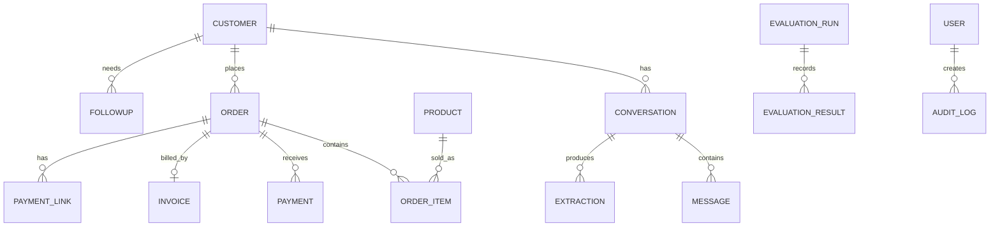

# NEXORA AI

**Conversational Business Intelligence + CRM Automation + LLM Evaluation**

> **Academic framing:** A Unified User-Centric Evaluation Framework for Large Language Models in Conversational Visual Analytics

Nexora AI transforms WhatsApp / Instagram / Telegram-style conversations into structured customer and business data. It combines an explainable LLM extraction pipeline, CRM automation, order operations, GST invoicing, simulated payments, follow-ups, analytics and a research-grade evaluation module.

## 1. Product vision

**Chat → Understand → Validate → Act → Measure**

Nexora is intentionally designed as a modern AI SaaS experience rather than a traditional CRUD admin panel. The dashboard surfaces signals first, then lets the user drill into conversations, customers, orders, finance, follow-ups, visual analytics and model evaluation.

## 2. Core pipeline

```text
Mock / Webhook Chat
       ↓
Message Normalisation
       ↓
LLM Extraction + Explainability
       ↓
Pydantic Schema Validation
       ↓
Entity Resolution
       ↓
CRM / Order Creation
       ↓
GST Invoice + Payment Simulation
       ↓
Follow-up Scheduler
       ↓
Conversational Visual Analytics
       ↓
Evaluation Lab
```

Every stage is designed to be independently testable.

## 3. Feature map

- Mock WhatsApp / Instagram / Telegram chat simulator
- TXT/JSON-ready ingestion architecture and webhook stubs
- English, Hindi and Hinglish extraction
- Customer, intent, products, order, payment and follow-up extraction
- Confidence scores and validation reports
- Product fuzzy matching and duplicate-customer strategy
- Human review queue architecture
- Order lifecycle: Draft → Confirmed → Paid → Packed → Shipped → Delivered / Cancelled / Refunded
- GST-aware invoice calculation and PDF generation
- Simulated payment links with success / failure / pending / partial outcomes
- Follow-up detection and reminder scheduler
- Lead scoring and customer segmentation
- Sentiment / urgency classification
- AI smart-reply architecture
- Customer 360 architecture
- Conversational analytics with whitelisted query specifications
- Technical + visual + user-centric evaluation framework
- SUS / trust / clarity measurement UI
- Role-aware authentication foundation
- Audit-log model
- PII/privacy configuration foundation
- Responsive premium dashboard with dark mode
- Docker Compose
- OpenAPI / Swagger
- pytest test suite

## 4. Technology

### Frontend
React + Vite + React Router + Recharts + Axios + Lucide icons + custom responsive CSS.

### Backend
FastAPI + Pydantic v2 + SQLAlchemy + Alembic + APScheduler + ReportLab.

### Data
SQLite for development, PostgreSQL-ready through `DATABASE_URL`.

### LLM
`LLMProvider` abstraction with deterministic `MockLLM` as the default offline provider. Provider configuration is environment-based so secrets are never hard-coded.

## 5. Project structure

```text
nexora-ai/
├── backend/
│   ├── app/
│   │   ├── api/
│   │   ├── core/
│   │   ├── evaluation/
│   │   ├── llm/
│   │   ├── models/
│   │   ├── pipeline/
│   │   ├── scheduler/
│   │   ├── schemas/
│   │   └── services/
│   ├── tests/
│   ├── Dockerfile
│   └── requirements.txt
├── frontend/
│   ├── src/
│   │   ├── services/
│   │   └── main.jsx
│   └── package.json
├── data/
│   └── gold_dataset.json
├── docs/
├── docker-compose.yml
├── .env.example
├── BUILD_PLAN.md
├── PRESENTATION_NOTES.md
└── README.md
```

## 6. Local setup

### Backend — Windows PowerShell

Use Python **3.13** or 3.12. Python 3.14 can force native compilation for some dependency versions.

```powershell
cd backend
py -3.13 -m venv .venv
.\.venv\Scripts\Activate.ps1
python -m pip install --upgrade pip setuptools wheel
python -m pip install -r requirements.txt
python -m app.seed
uvicorn app.main:app --reload --port 8000
```

Swagger: `http://127.0.0.1:8000/docs`

### Frontend

```powershell
cd frontend
npm install
npm run dev
```

Dashboard: `http://localhost:5173`

Set `VITE_API_URL` if the API is hosted elsewhere.

## 7. Docker

```bash
cp .env.example .env
docker compose up --build
```

## 8. Default demo mode

The project defaults to:

```env
LLM_PROVIDER=mock
```

This means the extraction pipeline works without an API key. OpenAI / Anthropic adapters can be connected later through the provider interface.

## 9. Demo flow

1. Open Overview.
2. Open Inbox and run the extraction studio with a Hinglish message.
3. Inspect extracted intent/product/language/confidence.
4. Open Orders and Finance.
5. Generate an invoice PDF from the API.
6. Open Follow-ups to show AI-generated reminders.
7. Ask a natural-language question in Ask Nexora.
8. Open Evaluation Lab and explain the three evaluation dimensions.

## 10. Research contribution

Nexora does not evaluate an LLM only on extraction accuracy. It evaluates the complete user-facing analytical system across:

- field precision / recall / F1
- exact match
- JSON validity
- schema pass rate
- hallucination rate
- latency / token cost
- robustness to typos and Hinglish
- chart-type correctness
- query-spec accuracy
- insight faithfulness
- task completion
- time-to-task
- manual corrections
- trust / clarity
- SUS usability score

## 11. ER diagram



## 12. Security / production notes

Payment and social-channel integrations are simulations/stubs. Before production: use PostgreSQL, HTTPS, managed secrets, real OAuth/JWT identity management, provider-specific webhook verification, CSRF/CORS controls, rate limiting at the edge and a compliant payment gateway.

## 13. License / academic use

Intended as an academic / portfolio demonstration and extensible product prototype.

## Live dashboard integration

The dashboard is connected to the FastAPI data layer rather than relying on the original illustrative KPI values. Overview KPIs, revenue series, channel mix, customers, orders, invoices, payments, follow-ups and evaluation results are loaded from API endpoints. The Inbox simulator writes a real conversation through the extraction pipeline and refreshes the conversation list.

### Reset demo data

From `backend/`, run `python reset_demo.py` whenever you want a clean demo dataset. This regenerates 30 conversations, conversation-derived orders, sample invoices/payments and follow-ups.

## 14. NEXORA 2.1 product polish

The current build includes a production-style extraction studio rather than a generic result card. Each extraction displays:

- intent, product, sentiment and language
- per-field confidence and source-message evidence
- schema validation state
- a five-stage live pipeline: Ingest → Extract → Validate → CRM → Action
- created order reference and amount when an order is generated
- scheduled follow-up details when detected
- explicit MockLLM offline/privacy status

The overview, analytics, orders, finance and follow-up views read from the same API/database, so actions taken in Inbox can change the workspace metrics.

### Demo credentials

The development API can bootstrap the demo administrator on the first login request:

```text
username: admin
password: nexora123
```

Change this immediately for any non-demo deployment and replace the development `SECRET_KEY`.

### Final verification

The packaged backend has been syntax-checked and the automated test suite passes. The local frontend was previously verified with Vite; the package intentionally does not contain `node_modules`, so run `npm install` locally before starting it.
