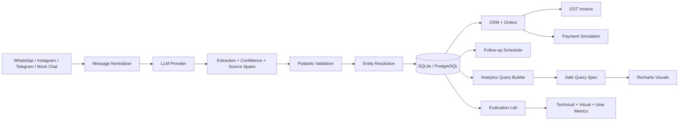

# Nexora AI Architecture

## Design principles

1. Offline-first demo mode.
2. Provider abstraction instead of vendor lock-in.
3. No raw SQL generated by the conversational analytics layer.
4. Every automated action is auditable.
5. Human review is available for low-confidence fields.
6. Research evaluation measures the complete user task, not only model output.
